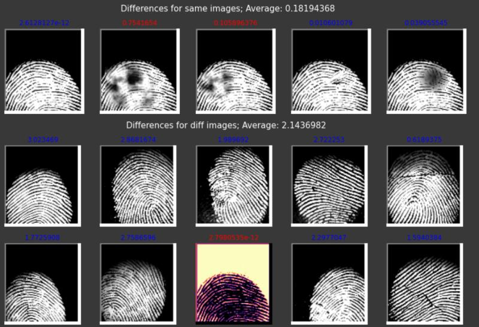

Here's a data science project on fingerprint recognition using one shot learning. Traditional models require a ton of data to be able to classify an instance as belonging to a particular class. By learning to compare similarity of images as opposed to classifying the images right away, these models are extremely robust and useful in cases where data is both dynamic & very sparse.  
  
The model uses the SOCOFing dataset from #kaggle. The model has the added advantage of being robust to smudges and alterations, thanks to the dataset which had synthetically altered finger print copies to mimic real world scenarios where the images might not be clean and plush.   
  
 Check out my notebook files from the link and shoot me your feedbacks. This is my first real project on data science and I would love to hear the areas I need to improve on.   
  
Github link: [https://lnkd.in/gEG2EDV](https://lnkd.in/gEG2EDV)  
  
 #datascience #machinelearning #deeplearning #neuralnetworks #fingerprint #oneshotlearning

  

