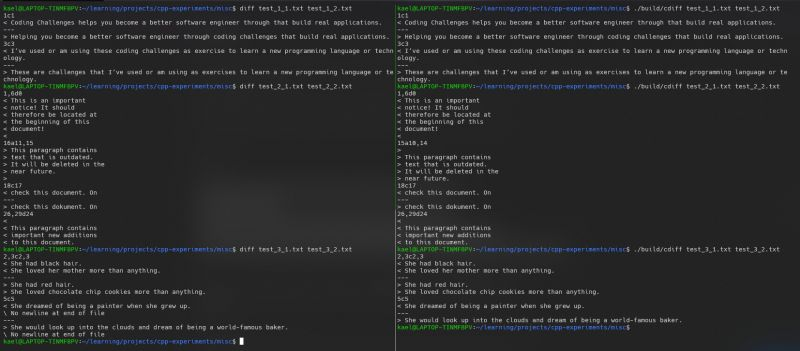
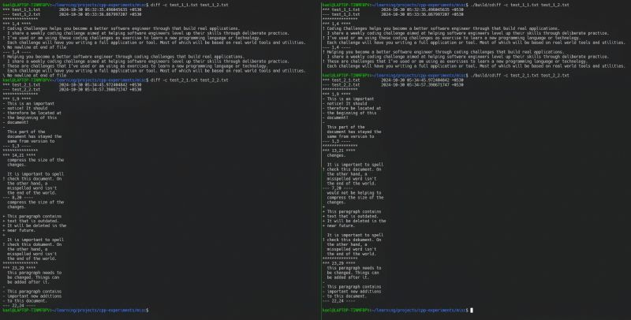
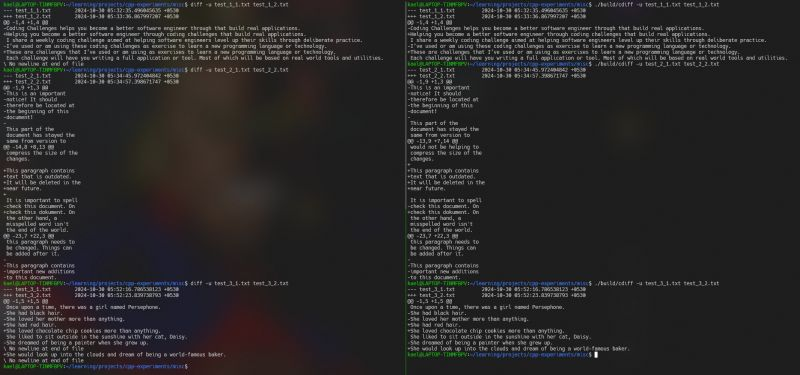

This week, I challenged myself to build a clone of another tool that we take for granted: the diff command-line utility. While we might not interact with diff directly every day, most developers have relied on its functionality at some point - whether for code reviews, version control, or merging files.  
  
Whats the diff Tool?  
  
The diff tool is a powerful yet straightforward utility for comparing two files provided as command-line arguments. It offers three modes:  
  
Default Mode: Displays only changes between the two files without additional context.  
Context Mode: Adds human-readable context with unchanged lines before and after changed lines.  
Unified Mode: Similar to context mode but more compact, merging separate outputs for concise readability.  
  
How can we attempt to replicate this functionality?  
  
The idea is to transform the task into a problem of finding the longest common subsequence between the two files being compared. This classic dynamic programming problem involves creating a 2D grid where we build the longest subsequence for each index by leveraging previously computed results to optimize performance. Once the grid is populated, we can backtrack to identify the matching and mismatching characters. By extending the LCS algorithm to operate on lines (treating each line as a single unit), we effectively create a functional algorithm for diffing files.  
  
This seems pretty straight forward, the real challenge to me, however, was tweaking the output to get as close as possible to the original diff utility's format.   
  
While it's still a work in progress compared to the full blown functionality of diff, I was able to successfully replicate its three main modes :)  
  
If you're a bit tired of traditional DSA problems and want to explore how these popular algorithms can be applied to real-world scenarios, definitely check out [Coding Challenges](https://www.linkedin.com/company/codingchallenges/)! Working through this challenge gave me a more intuitive understanding of LCS and its applications than any number of LeetCode problems.  
  
Curious to Try It?  
  
Check out my code on GitHub: [https://lnkd.in/gCfHZTBK](https://lnkd.in/gCfHZTBK)  
  
Challenge Link: [https://lnkd.in/gAsdGTkF](https://lnkd.in/gAsdGTkF)  
  
Wishing you all a wonderful Diwali!! 

  
  
  

