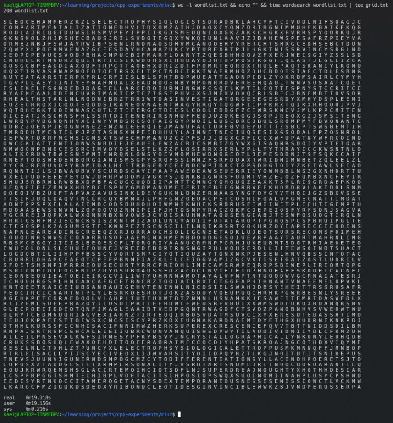
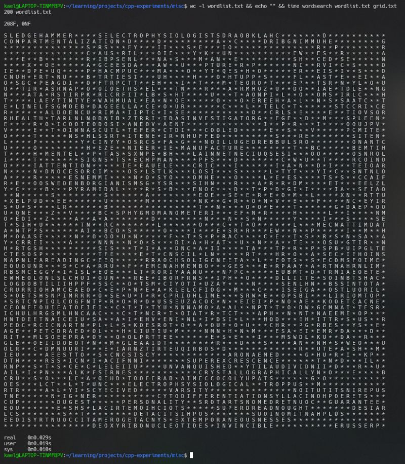

The past few weeks were hectic at work, leaving little time for side projects. But recently, I decided to tackle something that had been intimidating me for quite a while: building a word search puzzle generator. The sheer number of combinations required to generate a valid puzzle for a given set of words was overwhelming.  
  
I decided to begin with a simpler task - creating a board representation and building up a solver. The goal was to identify words in an existing grid efficiently. To speed up the search, I used a Trie data structure. Once initialized, the grid traversal was straightforward: iterating in 8 directions for each cell was done just once, regardless of the number of words.  
  
Next came the challenging part: the generator. Heres my initial algorithm:  
  
1. While words remain, repeat:  
 a. Find all possible placements (candidates) for all remaining words.  
 b. Sort candidates by priority: <overlap count, random tie-breaker, word, coordinates, direction>.  
 c. If a word has no valid candidates, backtrack.  
 d. Otherwise, place the word, remove it from the list, and repeat.  
2. If all candidates are exhausted, backtrack.  
  
In hindsight, generating candidates for all possible words was a bad idea. Starting with the solver and reusing existing code blinded me to its inefficiency. Even after noticing this, I assumed that I was just a few optimizations away from a blazingly fast generator.   
  
I doubled down on optimizing:  
1. Parallelize candidate generation: Massive speed up. Reassured my belief that optimizing was the key. Runs for smaller sized grids were now tolerable. 50+ words still weren't satisfactory.  
2. Prune Candidates: Instead of regenerating candidates each time, I generated them once and pruned as needed. This gave a nice speed boost, but puzzles with 75+ words were still too slow.  
3. Trie Tweaks: I modified the Trie to store the minimum word length starting from a node. This allowed me to prune cell searches earlier. A nice improvement, but still wasn't enough.  
  
Even with these optimizations, I remained far from the performance of online generators. I reasoned (lied to myself) that my puzzles were more compact since they prioritized overlaps. Maybe online generators werent checking all candidates? And then it hit me: I didnt need to check all candidates either.  
  
I simplified the approach:  
1. Pick a random word and generate candidates only for that word - this alone makes it orders of magnitude faster.  
2. Place a candidate and recurse to the next word.  
3. Backtrack if no candidates exist for a word.  
4. If all words are placed, we have a solution.  
  
Lessons Learned  
- Efficiency isnt just about optimization - its about simplifying the problem. My initial obsession with reusing solver logic led to an over-complicated generator.  
- Sometimes, a fresh approach bests incremental fixes.  
  
If you'd like to explore the code or experiment with it, check out: [https://lnkd.in/gT4URG3y](https://lnkd.in/gT4URG3y)

  
  

