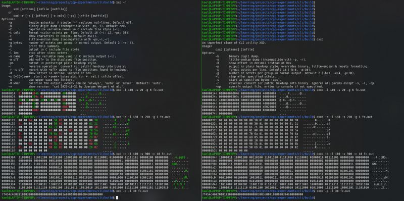
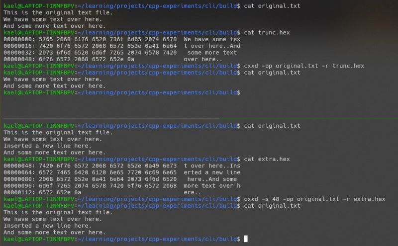
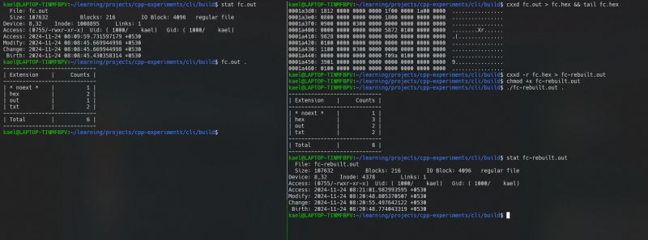

If you've ever worked with binary files, you know they can't be read directly like plain text. Tools like xxd bridge the gap, converting binary files into readable hexadecimal (or binary) formats. This utility, widely used by sysadmins and security specialists, is essential for tasks like debugging, reverse engineering, or just taking a peek at your compiled code.  
  
For example, binary files closer to home include Python's pickle files. Viewing a hex dump can reveal how such files are structured or even help reverse-engineer packaged binaries (a skill I hope to develop someday ). Tools like Cheat Engine or Lucky Patcher rely on similar functionality under the hood.  
  
Inspired by [John Crickett](https://www.linkedin.com/in/ACoAAAAADOIB1jesEqZdnwQE5csLme2tAbpHuMg)'s coding challenges, I decided to build my own version of xxd in C++ - a tool I will call cxxd. It supports key features like reading binary files, outputting them as hex or binary strings, and even reversing a dump back to binary.  
  
Personally, the most complex part was implementing the reverse dump functionality. In cases where the tool allows patches to be applied (instead of overwriting the entire file), only specific portions of the binary need modification.   
  
Things get tricky when:  
1) The patch size exceeds the range being replaced, risking overwriting adjacent bytes.  
2) The patch size is smaller than the range, requiring truncation or re-reading remaining sections to maintain file integrity.  
  
After a few frustrating sessions, I got it working. The attached images showcase the side by side comparison of the original and my clone.  
  
While it doesnt yet include all the features of xxd (like colored console output), it covers the essentials.  
  
If you're into CTFs, reverse engineering, or just enjoy tinkering with binary data, you might find this interesting.  
  
Feel free to check out my code here: [https://lnkd.in/gpxRECNJ](https://lnkd.in/gpxRECNJ)  
  
Coding Challenge Link: [https://lnkd.in/gezn4gjP](https://lnkd.in/gezn4gjP)

  
  
  

