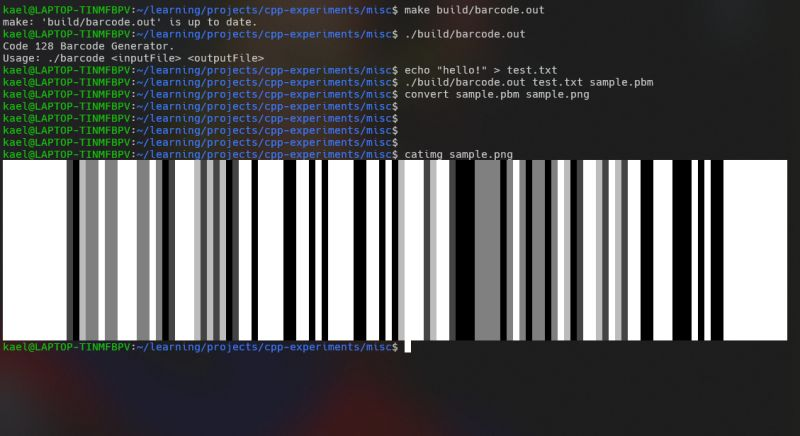
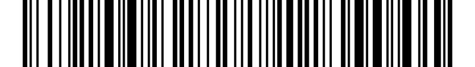

Initially, I planned to build a QR code generator from one of the weekly Coding challenges from John Crickett, but as I dove into the details, I realized how complex it was with so many moving pieces (sigh). While watching a YouTube video on QR codes, the author mentioned that barcodes were the precursor to QR codes. This sparked an idea in me to start with building a barcode generator first.  
  
Back in one of my previous roles, I used barcode4j in Java to generate barcodes for a web app. It felt effortless then, thanks to the abstraction. But diving into the mechanics of barcodes, I quickly learned that these had their own complexities.   
  
First, I needed to build a simple pipeline that provided me with quick feedback. I started by focusing on generating the barcode image (with dummy values). Now which format should I output? PNG? JPG? These come with their own complex compression algorithms, each a project in itself.  
  
I discovered something way simpler, PBM (Portable Bitmap). PBM allows you to write the image as a data matrix in binary or ASCII format. While not widely supported by modern OSes, I was able to view the PBM images via an online renderer. Eventually, I decided to install ImageMagick and added a conversion step to change the PBM into PNG format.  
  
Now, I really didn't know that barcodes came in several types. I chose to work with Code 128, one of the few that can encode the entire ASCII character set by switching between three code sets: Code A, Code B, and Code C. An added advantage of Code C is its ability to optimize numeric encoding by packing two digits into a single symbol. What's more, Code 128 has no inherent character limit - the real constraint comes from barcode scanners, which struggle with ultra-wide barcodes. The goal is to ensure that the end barcode is as compact as possible, making it easier for barcode scanners to read.  
  
To determine the best sequence of encoding (Code A, B or C), you need dynamic programming (surprise!). It felt similar to solving the LCS (Longest Common Subsequence) problem. The idea is to compute a grid that finds the shortest bit sequence to encode the string, then traverse it to extract the optimal encoding path. But here's the twist: it's not just about finding the sequence, its about deciding when to switch encodings or just shift characters. This distinction adds complexity, making it more than just a plain DP problem.  
  
After a couple days of exploring and experimenting, I finally built a working Code 128 Barcode Generator. My generator doesn't support the full ASCII set yet since that would involve using FNC4 character. It does support most average characters including control characters like newline, form feed etc.  
  
If youre curious about the implementation, feel free to check out my code on GitHub. Cheers!  
  
[https://lnkd.in/gxG29feS](https://lnkd.in/gxG29feS)

  
  

