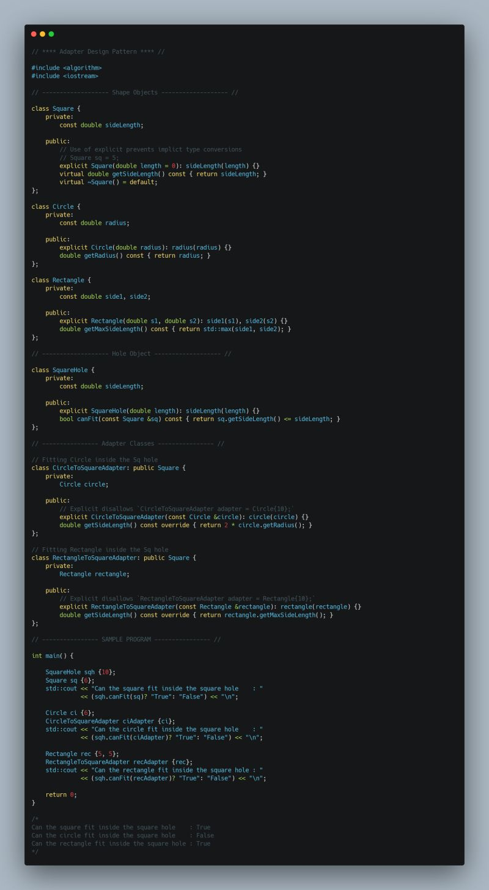
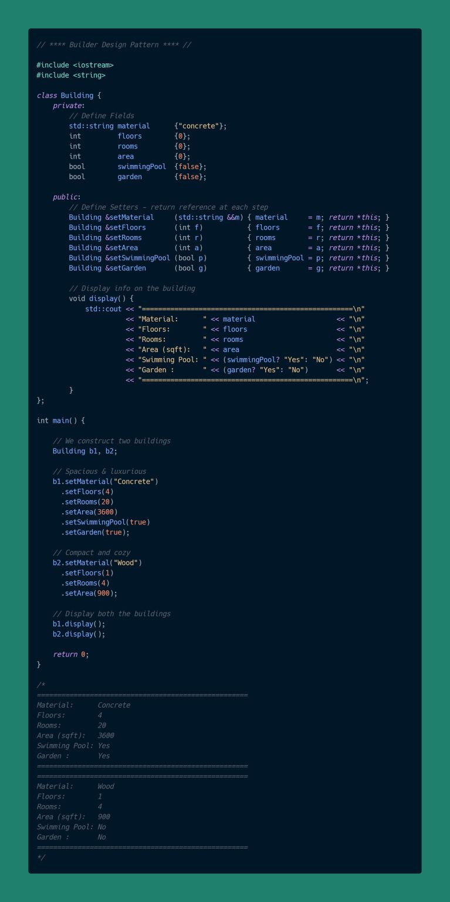
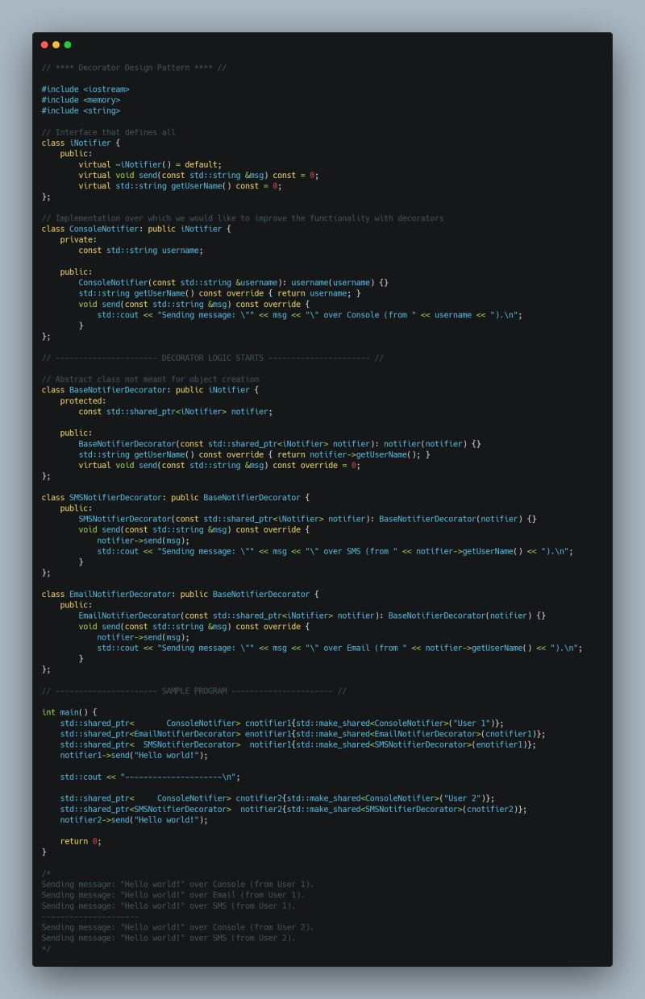
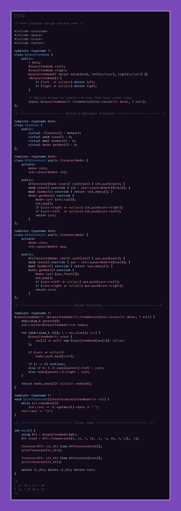

For this week, I decided to pick on something lightweight yet intriguing and design patterns felt like the perfect choice. Terms like "visitor pattern" and "observer pattern" were often tossed around, leaving me clueless at times. So, I decided to fix that by learning and implementing these patterns using C++.  
  
For the uninitiated, Software design patterns are "typical solutions to commonly occurring problems in software design". They serve as guidelines for writing scalable, maintainable, and reusable object-oriented code.  
  
I implemented a total of 25 design patterns which can be categorized into one of the 3 pattern types - Creational, Behavioral & Structural.   
  
I will touch very briefly on just a few patterns here:  
  
1 Adaptor (Structural): Converts one interface into another, allowing incompatible systems to work together.  
Example: An XML2JSONAdapter that converts data from a XML-based API into JSON format to work with a system expecting JSON input.  
  
2 Builder (Creational): It simplifies the creation of complex objects step-by-step.  
Example: A SQLQueryBuilder class that allows developers to build a SQL query by chaining methods like .select(), .where(), .join(), etc making the code more readable and maintainable.  
  
3 Decorator (Structural): Dynamically adds new behaviors to an object without altering its structure.  
Example: Python's @functools.cache that caches the outputs of any function with immutable args, adding functionality without altering the wrapped function itself.  
  
4 Iterator (Behavioral): Provides a way to access elements of a collection sequentially without exposing its implementation.  
Example: A DirectoryIterator that allows users to iterate through files and subdirectories in a directory tree.  
  
5 Singleton (Creational): Ensures a class has only one instance and provides a global access point.  
Example: A Logger class that writes log messages to a file, ensuring that only one instance of the logger handles all log operations throughout the program.  
  
This exploration gave me the opportunity to explore several interesting concepts in C++, listing just the topics for brevity:  
  
Virtual functions & pure functions  
The explicit keyword  
std::once_flag & std::call_once for thread-safe Singletons  
Templates & generic programming  
Using destructors for cleaner memory management (especially with raw pointers)  
Inheriting constructors with using parent::parent  
Inheritance access levels  
  
If you are curious, feel free to check out my implementations on GitHub: [https://lnkd.in/gbvZzUg4](https://lnkd.in/gbvZzUg4)  
  
Another excellent resource that I highly recommend for learning software design patterns: [https://refactoring.guru/](https://refactoring.guru/)

  
  
  
  

