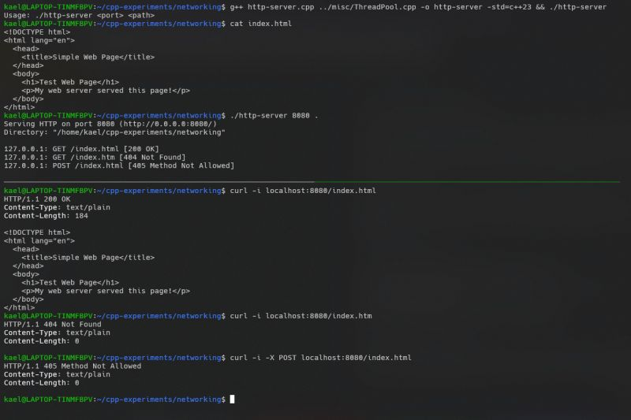

Lets code ourselves a simple HTTP server  
  
An HTTP server primarily handles static files and many of you might have used Pythons http.server module. I decided to try building something similar, but using C++ sockets.  
  
Theres something incredible about starting from scratch and building everything up, piece by piece.   
  
This project was inspired by [John Crickett](https://www.linkedin.com/in/ACoAAAAADOIB1jesEqZdnwQE5csLme2tAbpHuMg)'s Build Your Own Web Server challenge.  
  
The goal is to create and bind a TCP socket on a user-specified port and start listening for incoming connections. For simplicity, we can ignore the client-side handling of sockets.  
  
*** When a client connects ***  
  
- The OS creates a new client socket (a copy of our server socket).  
- We parse the request, ensuring its a valid GET request.  
- We extract the file path and handle edge cases like out-of-bounds requests (e.g., requesting //etc/passwd ).  
- If the requested file doesnt exist, we return a "404 Not Found".  
- For non-GET requests, we send back a "405 Method Not Allowed".  
  
*** Handling Concurrent Requests ***  
  
One of the more challenging aspects of this project was handling concurrent requests. Initially, I used a counting semaphore to limit the number of active socket connections. While effective, it led to excessive thread creation and destruction. To improve performance, I implemented a Thread Pool, reusing threads for multiple requests. This reduced overhead and improved response times significantly.  
  
*** Shutdown Logic ***  
  
What happens when you terminate the server? In a typical implementation, you wait for all threads to finish and stop accepting new connections. However, each thread may be waiting for a response or in the middle of sending one. To achieve a faster shutdown (like Pythons http.server), I opted for an approach where we force interrupt client sockets by tracking and shutting them down directly.  
  
If you're interested in the full implementation, check out my GitHub: [https://lnkd.in/gaJTsrzY](https://lnkd.in/gaJTsrzY)  
  
Coding Challenge Link: [https://lnkd.in/gcnpwgAG](https://lnkd.in/gcnpwgAG)  
  
Also, for a great guide on Thread Pool implementation, check out this tutorial by CppNuts: [https://lnkd.in/gwiWsheA](https://lnkd.in/gwiWsheA)  
  
#cpp #codingchallenges #networking

  

