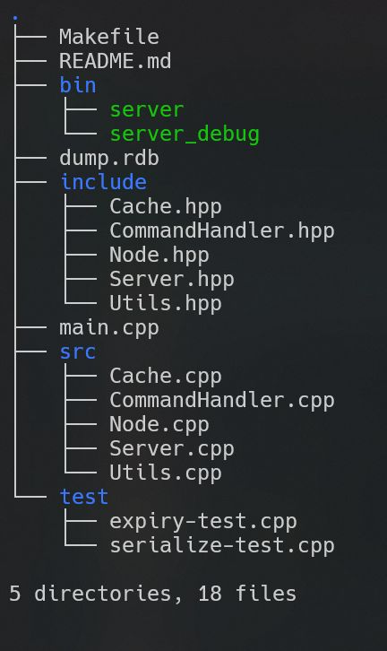
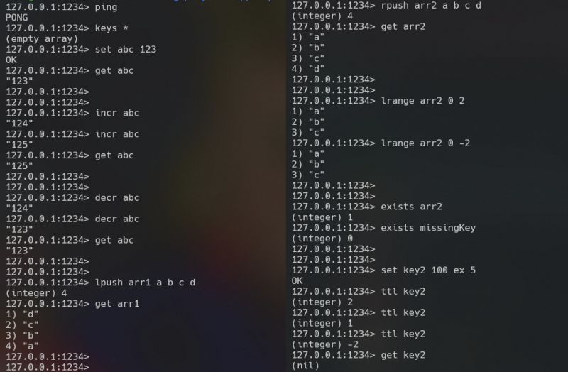
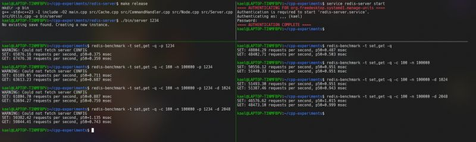
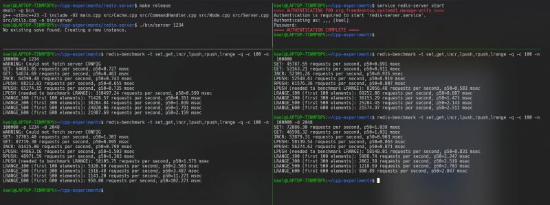

This time, I challenged myself to build a database. Well, not a traditional one, but a key-value store called REDIS (REmote Dictionary Server) known for its incredible speed thanks to being entirely in memory. Think of it as a server-side hashmap you can read/write to.  
  
When you are over-instructed, it gets boring; with too little guidance, you feel lost. [Coding Challenges](https://www.linkedin.com/company/codingchallenges/) strike that perfect balance, where you are guided without being spoon fed. You are given clear milestones to reach before diving into something deeper. Part of the reason why I love these challenges.  
  
1: The initial step involved writing logic to serialize & deserialize RESP (Redis serialization protocol) formatted strings, which is how Redis communicates with its clients. This step also requires you to think ahead on the data structures that you'd be using.  
  
2: Next step is to have a basic socket based pipeline ready and to implement the "ping" command. Send a ping, you will get back a "pong". Think of it like a health check.  
  
3: We then start with "get" / "set" commands that is the bread and butter of Redis, pretty straightforward.  
  
4: Handling multiple clients. I decided to give asynchronous programming a try. Imagine a restaurant, instead of employing 10 waiters to serve 10 customers (Parallel programming), we have a single server who doesnt wait while a customer is thinking about their order. The server simply moves to the next customer and returns once the first customer is ready. Similarly, we iterate and serve clients only as much as they can handle, without waiting. The challenge that I faced here was how to handle cases where I would get partial data in or when the data is too big to be sent at a time. How to store the state somewhere to resume later?  
  
5: Implement functionalities such as data expiry, "lpush", "lrange", "save", etc: Data persistence is one interesting thing about Redis. For simplicity, I only implemented the binary RDB file format. This can be used later to restore the state on server startup. Beyond the simple save command, it was interesting to implement the "bgsave" functionality. I used the OS's fork to create a process that saves in the background without blocking the main thread.  
  
6: Benchmarking performance with Redis-benchmark: I had to learn about profiling C++ code with gprof to figure out the portions of my code that are being too slow, needing optimizations. After several iterations I got a satisfactory point where most commands were doing okay. However, optimizing lrange for large datasets (set using the -d parameter) remained a challenge.  
  
Some new things I tried with C++ this time:  
Non blocking sockets with Linux Poll  
OS fork() to spawn processes  
gprof to optimize and figure out bottlenecks  
C++ Signals for interrupt handling  
  
Check out my implementation on GitHub: [https://lnkd.in/gmmPTryC](https://lnkd.in/gmmPTryC)  
  
Redis Coding Challenge: [https://lnkd.in/gzDfpMdp](https://lnkd.in/gzDfpMdp)

  
  
  
  

