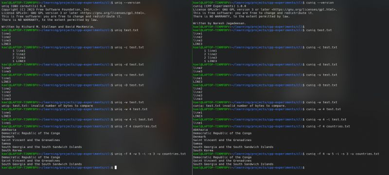
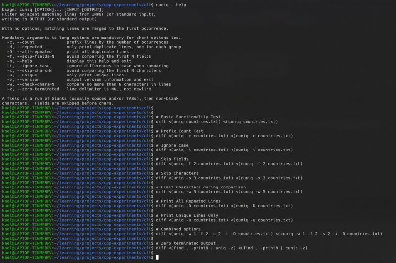
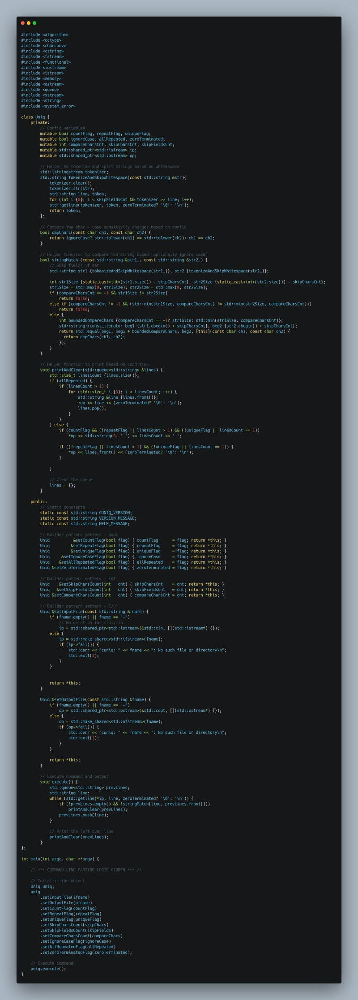

Uniq is a simple yet powerful linux command line utility that filters out duplicate lines from sorted input. By working on a presorted input, it only compares two lines at any point in time, being memory efficient even with very large files.  
  
I decided to clone this tool as part of my habit of working on projects that interest me.  
  
- Supports both standard IO and file streams  
- Built with no external dependencies, although a library for CLI parsing could have made the code more compact.  
- Designed using the Builder pattern to accommodate its rich configuration options.  
  
Check out my implementation: [https://lnkd.in/g8qBHWPq](https://lnkd.in/g8qBHWPq)  
Coding Challenge link: [https://lnkd.in/g_5CAA9X](https://lnkd.in/g_5CAA9X)

  
  
  

