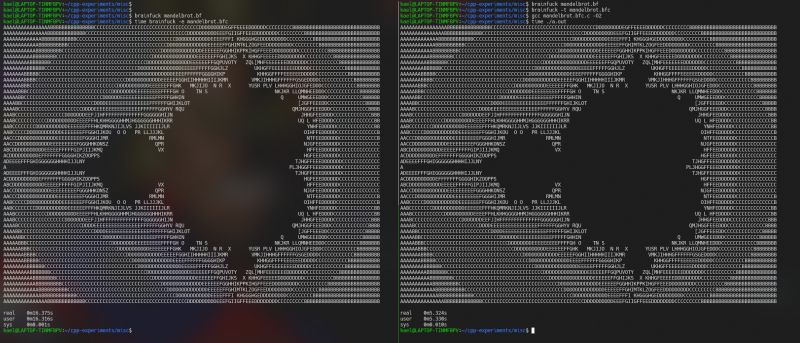
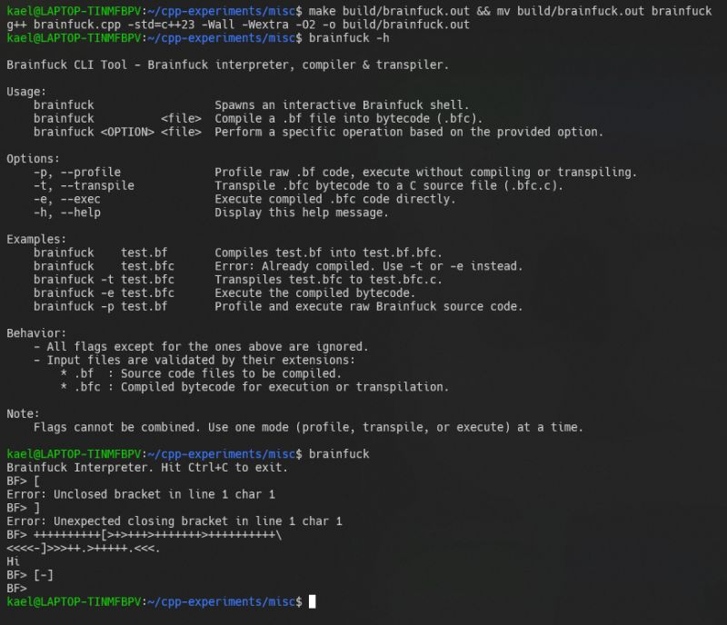
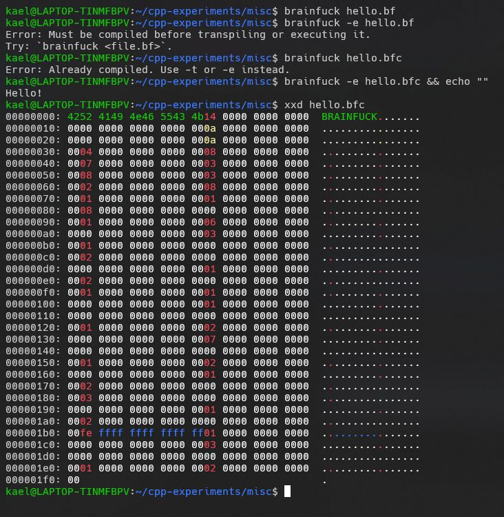
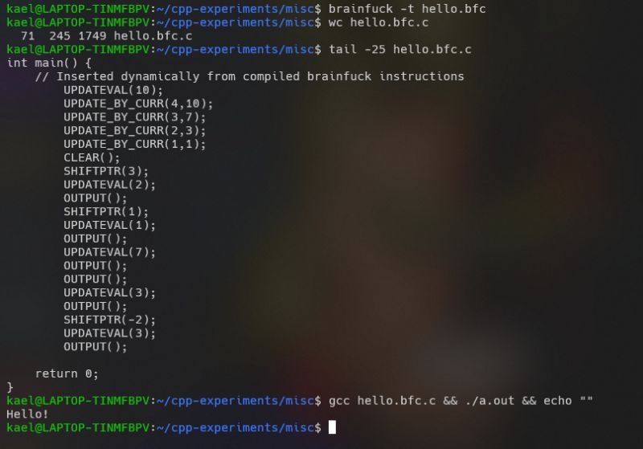

I recently built a compiler and interpreter for Brainf*ck, an esoteric programming language with only 8 instructions. Despite its minimalism, Brainf*ck is Turing complete, meaning it can theoretically compute anything a modern programming language can, albeit inefficiently. This simplicity made it the perfect playground for diving deeper into compiler design.  
  
Step 1: Building a REPL Shell  
We start by creating a REPL (Read-Eval-Print Loop) shell, similar to Pythons interactive interpreter. The shell continuously prompts for input, executes Brainf*ck code character by character, and ensures loops are balanced.  
  
Step 2: Reading and Executing from Files  
Next, we extend the interpreter to read and execute code from files. This functionality allows us to run more complex programs and benchmarks. While the interpreter works, it is still painfully slow for more complex programs like Mandelbrot pattern generator.  
  
Step 3: Optimizing for Performance  
Improving performance is challenging when executing instructions character by character. By batching simple operations, like combining "++++" into a single "+= 4" and precomputing loop jump positions to reduce redundant searches, we can achieve noticeable performance gains.  
  
Step 4: Building a Virtual Machine  
By this point we have already moved away from an interpreter and started designing something closer to a compiler. To make things extensible down the line, we would build a Virtual Machine. The VM executes compact bytecode compiled from Brainf*ck instructions.  
  
Step 5: Profiling and Introducing Higher-Level Operations  
To help identify common patterns, we add a Profiler that counts how often each loop runs and logs the data. This can help concretely measure and identify the most common patterns. For instance, we might notice patterns like [-] (resetting a memory cell to zero) appearing frequently. These patterns could then be abstracted into high level operations.  
  
Some of opcodes that I introduced:  
 1. CLEAR: Resets a memory cell to zero.  
 2. SHIFTPTR_ZERO: Moves ptr to first zeroed cell.  
 3. UPDATE_BY_CURR: Updates a cell based on the current pointers value.  
  
With these optimizations, the execution time for [mandelbrot.bf](http://mandelbrot.bf/) dropped from 30 seconds to ~15 seconds.  
  
Step 6: Transpiling to C  
To push performance further, I explored transpilation, converting Brainf*ck code into another language. I chose C for its simplicity and efficiency. By leveraging Cs compiler optimizations, the resulting binary executed the same [mandelbrot.bf](http://mandelbrot.bf/) program in under 5 seconds, a massive improvement over the interpreted version.  
  
Check my code on GitHub: [https://lnkd.in/gY5rtebH](https://lnkd.in/gY5rtebH)  
Coding Challenge: [https://lnkd.in/gGCdhbXH](https://lnkd.in/gGCdhbXH)  
  
Special thanks to [John Crickett](https://www.linkedin.com/in/ACoAAAAADOIB1jesEqZdnwQE5csLme2tAbpHuMg) for the inspiration and the fantastic set of [Coding Challenges](https://www.linkedin.com/company/codingchallenges/)!

  
  
  
  

