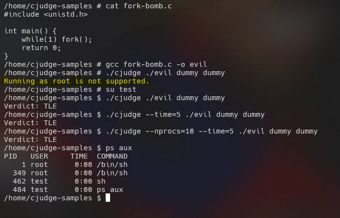
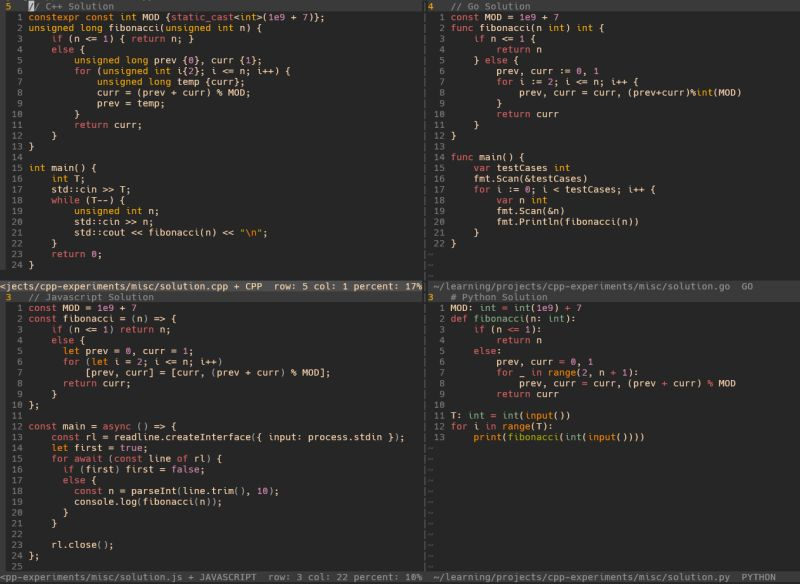
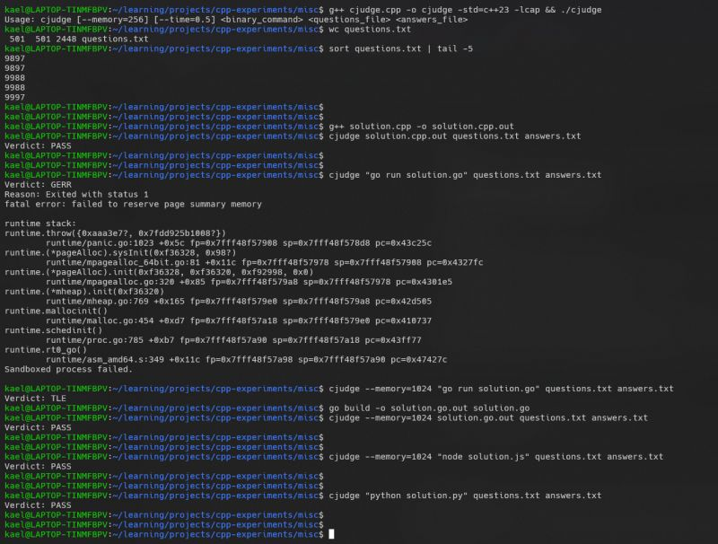

I coded myself an offline CLI Codejudge.   
  
It executes a binary command against an input file and compares the result with an expected output. Sounds straightforward, right?   
  
I made it more interesting by adding these constraints:  
  
- Runtime limit  
- Memory constraint  
- Run arbitrary code without worries (sandbox)  
- Must run rootless  
  
How I Achieved This?  
  
1 Runtime Limit: Spawn a timer thread tied to the forked sandbox PID. If the process exceeds its time limit, kill all processes except the main one. This is safe due to PID namespace isolation, preventing stray processes from lingering.  
  
2 Memory Constraint: cgroups are the modern approach, but since I wanted a rootless setup, I used setrlimit() instead. Works well, except on root processes where limits don't apply, so the judge aborts if run as root.  
  
3 Arbitrary Code Execution: The most exciting part! Linux namespaces isolate the process on multiple fronts (PID, Mount, Network, etc.), making it believe it's the only process running, this is the same tech that powers Docker / Podman.  
  
4 Rootless Execution: The most challenging (time consuming) part! Running as root makes things easier (cgroups, mounts, etc.), but I wanted a true rootless sandbox. This constraint forced me to get creative. The code is decent enough to execute a fork bomb written in C.  
  
Execution Status Codes  
- PASS: Output matches, ran within limits  
- FAIL: Output mismatch  
- TLE: Time limit exceeded  
- MLE: Memory/resources exceeded  
- GERR: Generic error (syntax, runtime, etc.)  
  
Take it for a spin and let me know how it fares!   
  
For added safety, I recommend running cjudge inside a Docker container before testing any potentially malicious code. This ensures that even if cjudge doesn't work as expected, Dockers isolation keeps your host system safe.  
  
Github link: [https://lnkd.in/g8u7KRsT](https://lnkd.in/g8u7KRsT)

  
  
  
  

