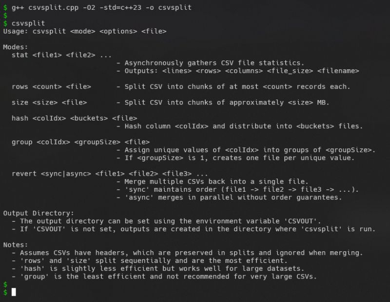
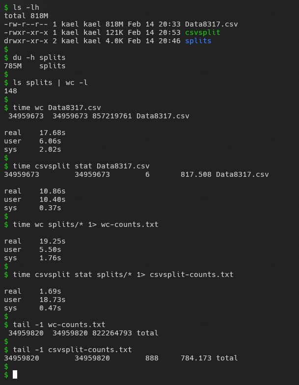
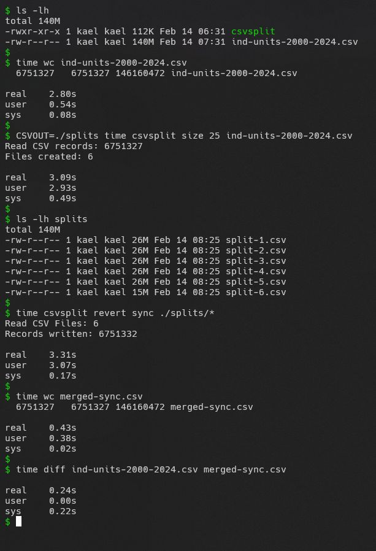
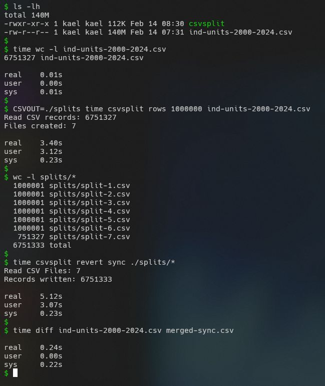

Have you ever struggled with a massive CSV file that wouldnt fit into memory?   
  
Common approaches like pandas with chunksize, or using dask / pyspark, work great, but I wanted something lightweight, fast & homegrown. I felt like this was a common enough use case to warrant a CLI tool of its own. So I built a Command Line CSV Splitter: csvsplit.  
  
Supported Functionalities:  
 Split by Size: Break a 5GB CSV into 500MB chunks.  
 Split by Rows: Divide 1B records into smaller 500K-line files.  
 Split by Column Values: Create separate CSVs for each unique value in a column.  
 Split by Column Hashing: Efficiently bucket unique values without memory overhead.  
 Merge (Revert) CSVs: Supports sync (preserves order) and async (parallel merge).  
 Stat Command: Quickly extracts CSV metadata (rows, cols, lines, file size) from one or more files asynchronously.  
  
Parsing a 800MB CSV (~35M lines) takes ~10s, making it a decent alternative to traditional libraries, especially when you just need to get things done without extra Jupyter notebook code.  
  
Check out the code here: [https://lnkd.in/gTZKgjed](https://lnkd.in/gTZKgjed)

  
  
  
  

