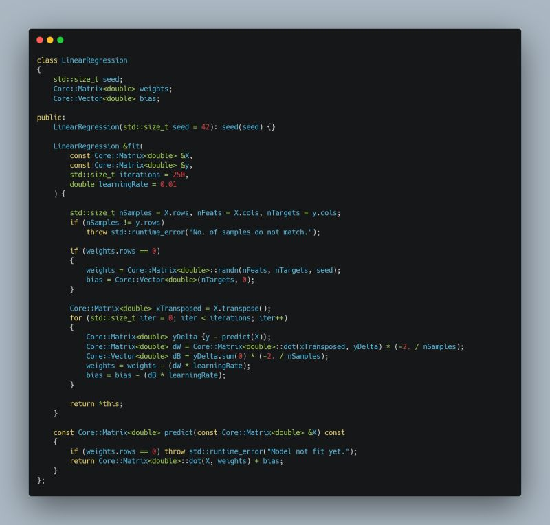
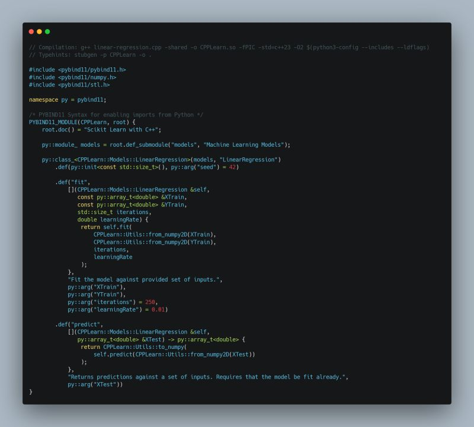
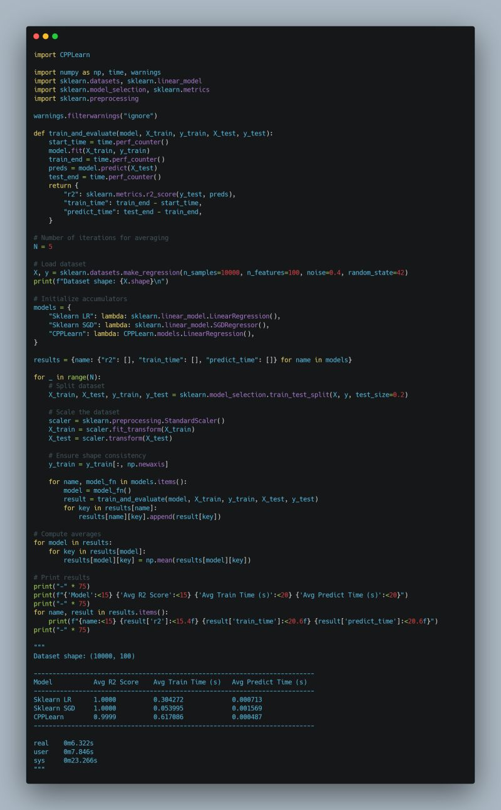

How do we combine the efficiency of C++ with the user friendliness of Python?   
  
Enter C++ extension modules.  
  
I decided to experiment by implementing a Linear Regression model in C++ and integrating it into Python, using pybind11.  
  
1 Implementing Linear Regression in C++  
  
I started with a naive std::vector based approach. While Scikit-Learn uses the Normal Equation, I used Gradient Descent and added a normalization step in Python for results comparability.  
  
2 Creating the Python Extension Module with Pybind11  
  
Compiling the C++ code as a shared object (.so) makes it directly importable in Python, thanks to the CPython runtime. Pybind11s syntax was surprisingly intuitive, even supporting docstrings for usability.  
  
3 Comparing CPP-Learn vs. Scikit-Learn  
  
Initially, my C++ implementation was 10 slower than Scikit-Learn's, which leverages NumPys optimized C extensions. Profiling and some online research revealed that the dot product was the main bottleneck - not the O(N^3) algorithm, but the underlying data structure.  
  
4 Optimizing with Custom Matrix & Vector Classes  
  
Nested std::vectors arent always contiguous in memory, making row-wise operations expensive. Inspired by NumPys layout, I redesigned my Matrix class to store data in a contiguous 1D array, with 2D access via index math.  
  
Its fascinating that, even with the same algorithm, this change alone led to significant performance gains, now running on par with Scikit-Learn for small to moderate datasets, though NumPy still has the edge for very large datasets.  
  
 Key Takeaway  
  
Performance isnt just about algorithms. Memory layout and data structures can be just as crucial, even in C++.  
  
If you're curious about the full implementation, check it out here: [https://lnkd.in/gQf9fvV6](https://lnkd.in/gQf9fvV6)

  
  
  

