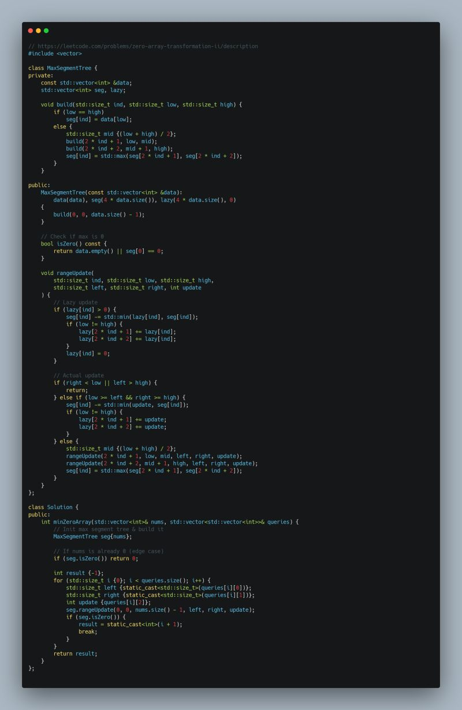

Leetcode Problem of the Day: Zero Array Transformation - II  
  
Given an array and a series of queries, each query allows us to decrement values within a specified range by at most the given amount. Find the minimum number of queries required to turn the entire array into zeros.  
  
Approach  
- Minimum queries to reach target: Be greedy and always subtract the maximum possible amount (without going below zero).  
- Range queries and updates: Segment Tree + Lazy Propagation.  
- Termination Condition: When the maximum value in the array becomes 0.  
  
Related resources from [takeUforward](https://www.linkedin.com/company/takeuforward/):  
- Segment Tree: [https://lnkd.in/g42B38Mt](https://lnkd.in/g42B38Mt)  
- Lazy Propagation: [https://lnkd.in/gup9Abyv](https://lnkd.in/gup9Abyv)  
  
#Leetcode #Coding #SegmentTree #LazyPropagation #POTD

  

