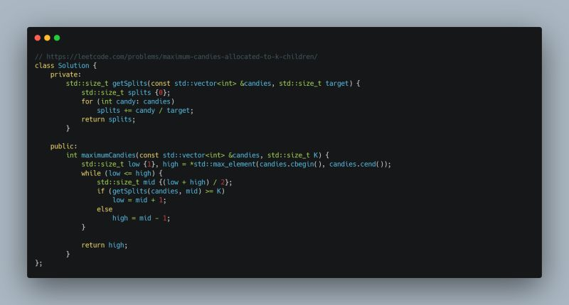

Leetcode Problem of the Day: Maximum Candies Allocated to K Children  
  
Given N piles of candies, how can we distribute them among K children while maximizing the candies each child gets? We can split piles into smaller ones but cannot merge them.  
  
Naive Approach:  
For a target X candies per child, we check if it's feasible by counting how many piles we can create. This takes O(N) time. Iterating over possible values results in roughly O(N x N) complexity.  
  
Optimized Approach:  
Instead of checking one by one, we binary search for the maximum feasible X. If X=5 isn't possible, then X=6, 7,  won't be either. This reduces complexity to O(N log N).  
  
#Leetcode #POTD

  

