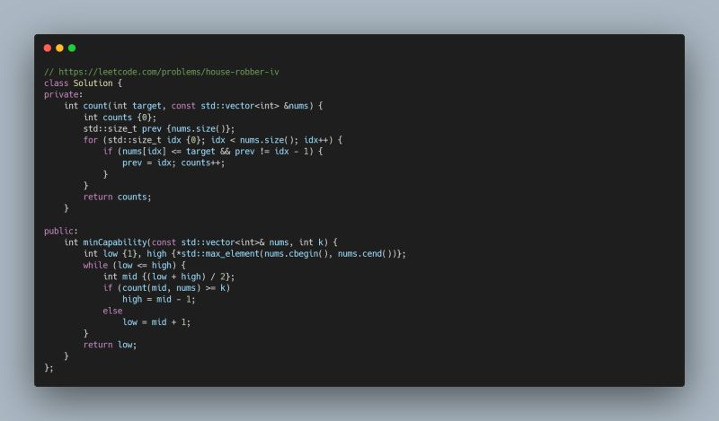

Leetcode Problem of the Day: House Robber IV  
  
A robber must loot at least k houses, but as always, he cant rob adjacent ones. His capability is defined as the max amount he steals from a single house, and our goal is to minimize this value.  
  
For problems that involve minimizing the maximum (or vice versa), binary search is often a good fit. Here, we binary search on the possible capability values, using a greedy check to determine if a given value allows robbing at least k houses.  
  
Approach  
- Iterate through houses and greedily pick those  target while ensuring we skip adjacent ones.  
- Use binary search to find the lowest valid capability.  
  
#LeetCode #BinarySearch #POTD

  

