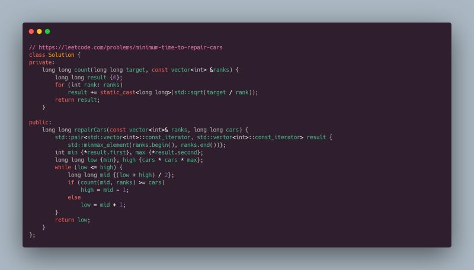

Leetcode Problem of the Day: Minimum Time to Repair Cars  
  
Given mechanics with different ranks, where a mechanic with rank "r" takes "r * (n x n)" minutes to repair n cars, we need to find the minimum time to repair all cars.  
  
Approach:  
- We only need to determine the maximum time required by any mechanic.  
- Use binary search, check if we can repair the required no. of cars within the target time.  
- For each "mid" time, count how many cars can be repaired using sqrt(time / rank).  
  
This is the third consecutive binary search problem from LeetCode :)  
  
Problem link: [https://lnkd.in/g-wntiV4](https://lnkd.in/g-wntiV4)  
  
#LeetCode #POTD #BinarySearch

  

