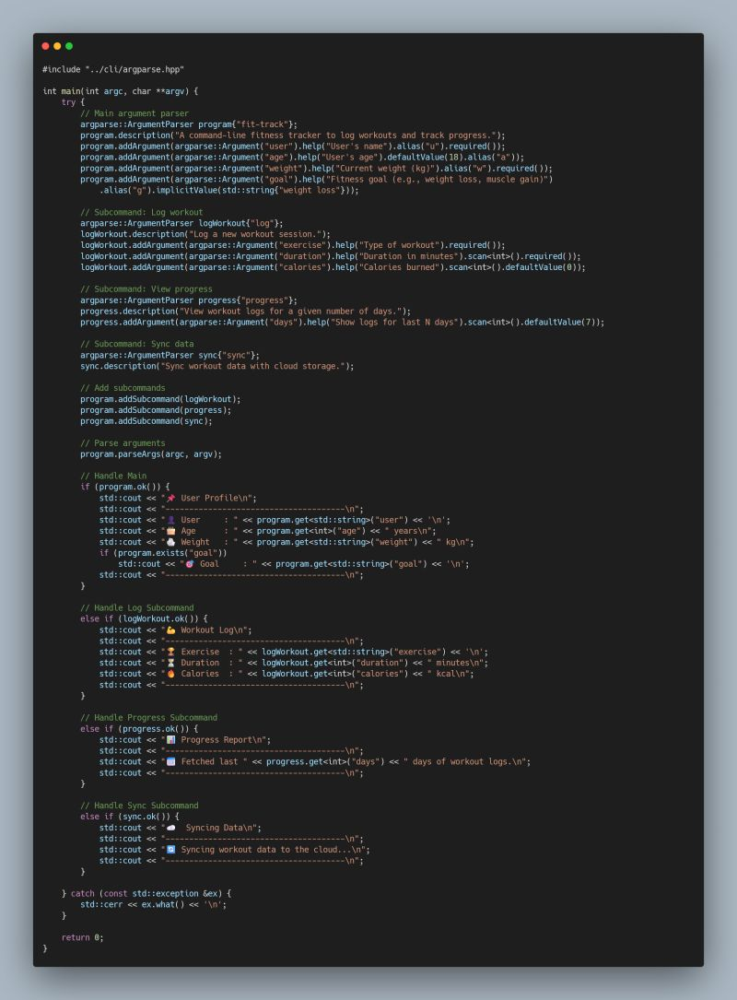
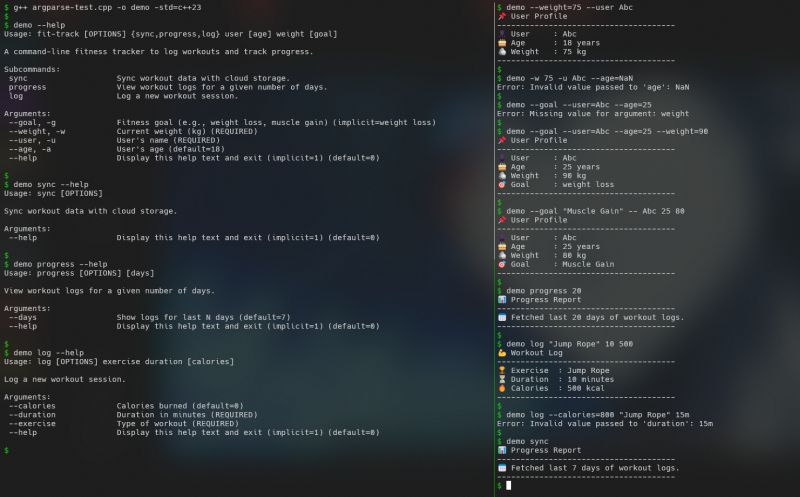

Ever since I started playing around with C++, I've had this urge to keep my side projects as dependency-free as possible. While it's not always practical, I take pride in achieving more with just the STL.  
  
One thing I've been putting off for a while is building more complex CLI tools because I didnt want to rely on libraries like CLI11 for argument parsing. So, I finally decided to build my own: a tiny, header-only CLI parser - argparse.  
  
While it may not be as feature rich as well established parsers, I plan to extend it as the need arises.  
  
 Features  
 Supports multiple data types: bool, int, float, double, string, vector<string>  
 Named arguments, aliases, and positional arguments  
 Implicit and default values  
 Subcommand support  
 Auto-generated help  
 Chainable interface for better usability  
  
 Check out the code here: [https://lnkd.in/gnvctCtW](https://lnkd.in/gnvctCtW)

  
  

