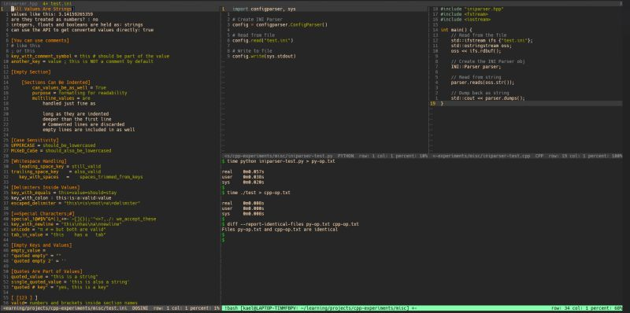
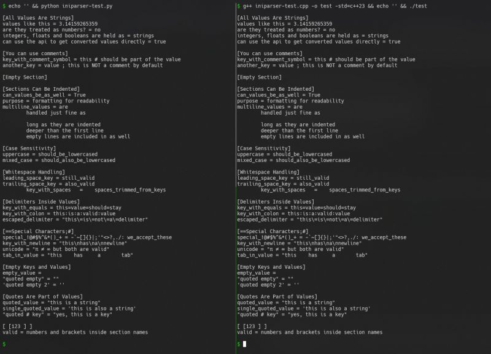

Adding to my collection of homegrown C++ libraries, Ive built an INIParser, closely mimicking Pythons `ConfigParser` library. While not as customizable yet, it should be fairly easy to extend.  
  
For those unfamiliar, .INI files are a simple, human-readable format for configuration files, using sections, keys, and values. The syntax is relaxed, allowing flexible spacing and indentation.  
  
While working on this, I found myself missing one of Pythons underrated features: dictionaries that preserve insertion order while supporting O(1) inserts and deletes. To fill this gap, I built stdx::ordered_map, a wrapper combining std::list (to maintain insertion order) and std::unordered_map (for fast lookups, inserts, and deletions).  
  
This parser is the second component of the CLI tool Im recreating, the first being a CLI argument parser (which I posted about earlier).  
  
Can you guess which tool Im trying to clone?   
It might be a bit vague now, but the next library I add should make it more apparent. Ill drop more hints in my next post, stay tuned :)  
  
Check out the code here: [https://lnkd.in/g-8r5HvP](https://lnkd.in/g-8r5HvP)

  
  

