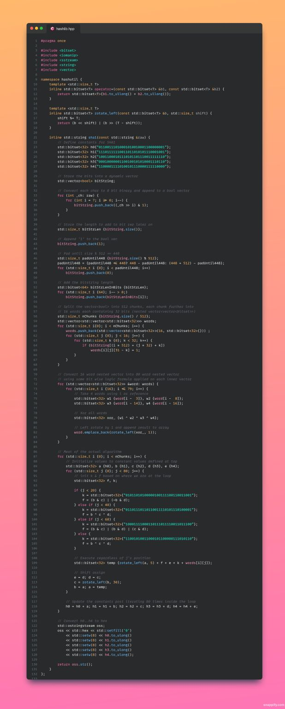

The third piece of our CLI application is an implementation of Pythons `hashlib`. Luckily, we only need one cryptographic function (for now): SHA1 hash encryption.  
  
SHA1 hashes are everywhere. The most interesting thing about SHA1 encryption is that regardless of input size, the output is always a uniform 40 character hexadecimal string. Since SHA1 is a one-way cryptographic function, the original message cannot be recovered from its hash. However, it remains incredibly useful for verifying data integrity. By hashing a received or stored copy of the data and comparing it to the original hash, we can detect any unintended modifications.  
  
Some common applications of SHA1  
File integrity verification: When downloading files (ISOs, software updates, etc.), SHA1 hashes are provided to ensure the file hasn't been tampered with.   
Git version control: Git extensively uses SHA1 to uniquely identify commits, trees, blobs, and tags, ensuring data integrity, optimizing storage and enabling efficient lookups.  
Digital signatures: While no longer the strongest option, SHA1 was once widely used in cryptographic signing to verify document authenticity.  
Data deduplication: SHA1 helps detect duplicate files efficiently by comparing hashes instead of entire files.  
Torrenting & P2P networks: SHA1 hashes help verify file chunks in peer-to-peer networks, ensuring data consistency.  
  
Heres an incredible YouTube tutorial I found, where the author implements SHA1 from scratch in JavaScript: [https://lnkd.in/gEegV-eV](https://lnkd.in/gEegV-eV)  
  
Ive graciously borrowed portions of his code and re-implemented SHA1 in C++, in under 150 lines of code.  
  
Can you now guess what I'm building?  
  
One of the above SHA1 use cases directly reveals the project Im working on. Test your answer by checking against the SHA1 hash below (all lowercase, by the way ;)  
  
[[ 46f1a0bd5592a2f9244ca321b129902a06b53e03 ]]

  

