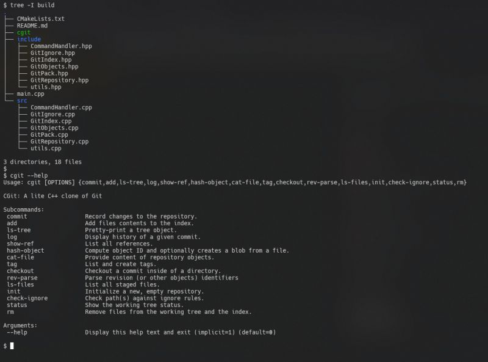
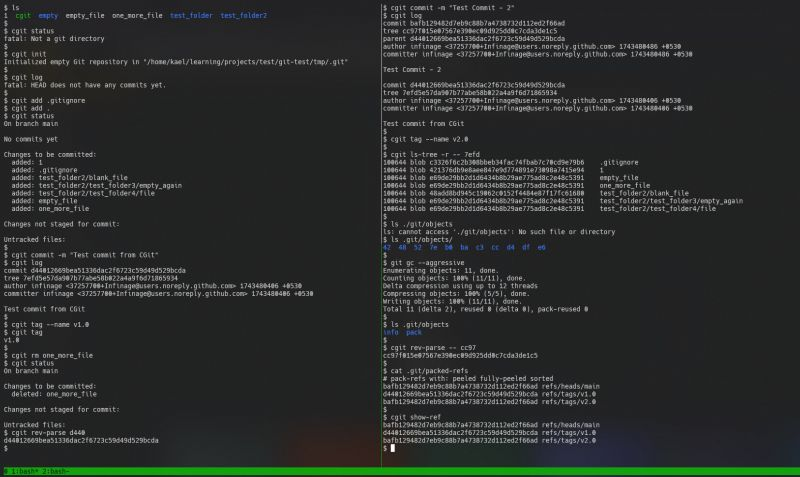

Git is hands down one of the coolest pieces of software ever built. Linus Torvalds wrote the first version in just 5 days - long before ChatGPT or even decent autocompletion tools existed. Every time I think about this, I feel both humbled and inspired.  
  
For the longest time, I've wanted to break Git apart and reconstruct something similar from scratch. And today, unveiling my latest project: CGit - A lightweight C++ implementation of Git!   
  
No external libraries were used, except zlib for compression/decompression.  
  
At its core, Git represents files as "blobs", directories as "trees", and tracks changes through "commits" and "tags", with the "index" serving as a staging area. All of this data is initially stored as loose objects inside ".git/objects", which is fast but not memory-efficient. To optimize storage, Git uses packfiles, which store only the differences (deltas) between objects. When needed, Git reconstructs full objects by resolving these deltas.  
  
Implementing packfile support was one of the most challenging yet rewarding parts of this project. With limited resources available online, I had to rely on xxd hex dumps and Gits verify-pack command to reverse-engineer the format and implement proper support.  
  
 Supported Commands  
  
> Porcelain (User-Friendly) Commands <  
 add - Stage changes  
 rm - Remove files  
 commit - Save changes  
 log - View commit history  
 init - Create a new repo  
 status - Show repo state  
 checkout - Switch commits  
 tag - Manage tags  
  
> Plumbing (Low-Level) Commands <  
 ls-tree - Display a tree object  
 show-ref - List references  
 hash-object - Hash a file into an object  
 cat-file - Read repository objects  
 rev-parse - Parse revisions  
 ls-files - Show staged files  
 check-ignore - Test ignore rules  
  
 Inspiration:  
 [https://wyag.thb.lt](https://wyag.thb.lt/) - A fantastic Python-based Git implementation that served as both an inspiration and a guide.  
 [https://lnkd.in/g3tV2erB](https://lnkd.in/g3tV2erB) - [John Crickett](https://www.linkedin.com/in/ACoAAAAADOIB1jesEqZdnwQE5csLme2tAbpHuMg)s Git Challenge gave me the nudge to finally tackle this.  
  
"Checkout" the code here (pun intended ;): [https://lnkd.in/g8MezBad](https://lnkd.in/g8MezBad)

  
  

