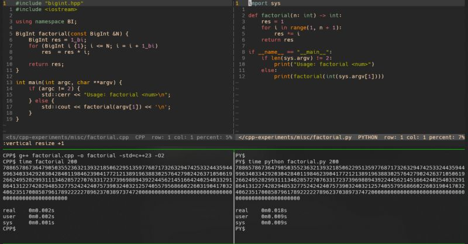

Ever wondered how Python stores integers that are arbitrarily large?   
  
Most languages limit numbers to fixed sizes: short, int, long, etc. But Python's int can grow indefinitely. This seemed more like an exception than the norm, so a conversation with a friend got me curious: How does Python make this happen?  
  
Turns out, Python represents integers as an array of unsigned integers in base 2 ^ 30.  
  
Why 2 ^ 30? Because that's the largest power of 2 that fits inside a 32-bit integer. Large numbers are chunked into smaller parts and stored in little-endian order (least significant chunk is stored first), making arithmetic operations simpler.  
  
For example, Python stores 1152921504606846976 as {0, 0, 1}  
  
((2 ** 30) ^ 0) * 0) + (((2 ** 30) ^ 1) * 0) + ((2 ** 30) ^ 2) * 1)  
  
This naturally led me to ask: Can we implement something similar?   
  
I wrote a quick bigint.hpp, and it turned out to be more fun than expected.   
  
At first, I tried storing values in base 2 ** 30, but parsing arbitrarily large strings became tricky. Converting them to base 2 ** 30 and back wasnt as straightforward as I expected.  
  
I settled for something simpler: base 10,000 using unsigned short values.   
  
While not as efficient as Pythons approach, it avoids the complexity of base conversions. Parsing is trivial, just split the string into 4-digit chunks and store them. Implementing arithmetic operations was a little challenging. Generously sprinkled operator overloads made the code much cleaner. I even got a chance to experiment with user-defined literals.  
  
Check out my code here: [https://lnkd.in/gKvDPMMx](https://lnkd.in/gKvDPMMx)

  

