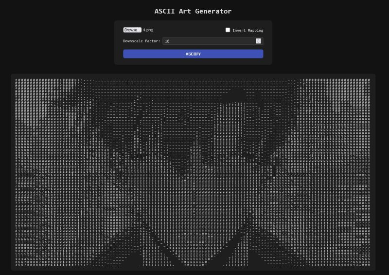
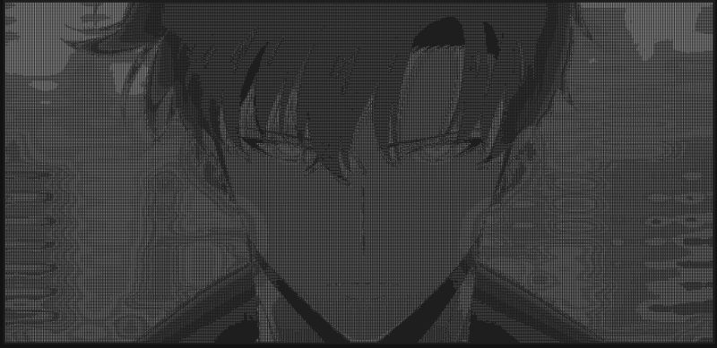

ASCII Text Image Generator: Powered by C++ and WebAssembly  
  
ASCII art had always fascinated me, so I finally decided to build one. To my surprise, the core logic is incredibly simple:  
  
1 Grayscale conversion: Convert each pixel to a single intensity value, typically the average of the RGB channels.  
2 Character mapping: Map that intensity to a character based on visual "density". For example, `@` appears heavier than `.`, while a space is the lightest.  
  
Thats really all it takes to generate surprisingly decent ASCII'fied images. With this sorted out, I got curious about what else I could add.  
  
Downscaling: Some images were too large to be rendered properly in the terminal or browser. So, I added support for downscaling using a simple NxN filter with stride N. Essentially average pooling, if you're from the ML world. Maybe not the most sophisticated, but it works pretty well.  
  
CPP + WebAssembly: Instead of rewriting everything in JavaScript, I compiled the C++ logic to WebAssembly. Its a nice middle ground: keep the performance benefits of C++, and use JS only for the UI. embind made interop smooth, though setting up autocompletion and tooling needed some tinkering.  
  
Deployment: The final app is deployed in a minimal Docker container (BusyBox + static files) on my AWS Lightsail instance. The entire image is just a little over 2MB.  
  
 Live Demo: [https://lnkd.in/gsi5kYfc](https://lnkd.in/gsi5kYfc)  
 Tip: Use high-contrast PNGs for the best results.

  
  

