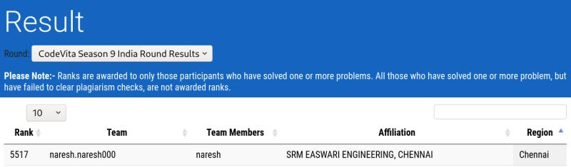

Hello Connections!   
  
I am delighted to share with you all that I have secured an All India Rank of 5517 in the TCS Code Vita preliminary round out of 180k+ participants all around India.   
  
It was a 6 hr of non stop competitive programming and I enjoyed coding the solutions using pure python. Although, I have to admit that I missed Numpy a bit :P  
  
Looking forward to doing better on the Qualifier round!   
  
#competitiveprogramming #tcscodevita #coding

  

