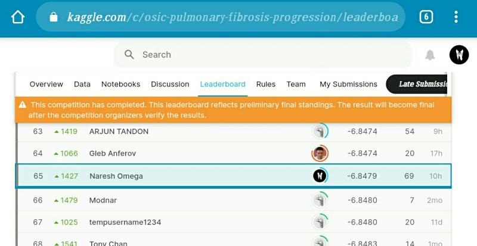

Hello Connections, I'm thrilled to share with you all that I have secured a rank of 65 in the OSIC pulmonary fibrosis competition, where we have to predict the lung capacity decline of patients over a period given a baseline FVC value & CT scans for the patient.   
  
After a ton of experiments, my winning solution was a GBR model along with some tabular data augmentations, this scored a CV of -6.8897 in the public LB and a -6.8479 on the private LB.  
  
It was quite unexpected and yet delightful that I landed a silver given that this is my first serious kaggle competition. Kaggle was intimidating to me initially however I am really starting to warm up to it and love this wonderful platform.  
  
[https://lnkd.in/gXdzHPC](https://lnkd.in/gXdzHPC)  
  
#kaggle #datascience #deeplearning

  

