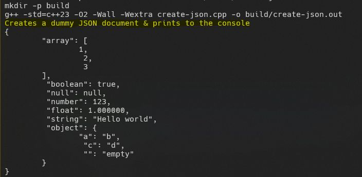
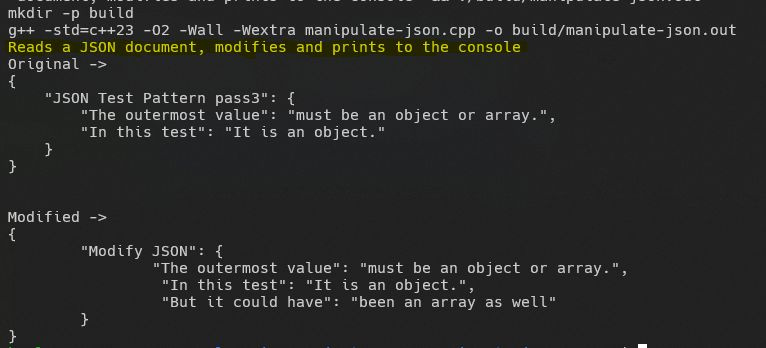

Whenever I searched for interesting projects, I'd often come across the same kindse-commerce sites, to-do lists, or employee management systems. While those have their merits, I found them a bit repetitive and not as fun. I wanted something deeper, something that really pushed my skillschallenging and equally rewarding. Thats when I stumbled upon [John Crickett](https://www.linkedin.com/in/ACoAAAAADOIB1jesEqZdnwQE5csLme2tAbpHuMg)s [Coding Challenges](https://www.linkedin.com/company/codingchallenges/). Neatly organized and structured, these projects range from simpler ones like Minesweeper to intricate challenges like building your own Docker. It's a great resource for anyone looking to level up their game by building real-world tools.  
  
I decided to take on building a JSON Parserreasoning that it wouldnt require much beyond the basic libraries that come with any programming language. To make it even more challenging, I chose C++ as the implementation language. It seemed simple at first, but it quickly became much more complex than I had anticipated.  
  
Designing a tree-like data structure for the parser was a key part of the project. While I had an intuitive sense of this, it wasnt until I found a helpful Stack Overflow thread that I could properly visualize how everything fit together. I also leveraged inheritance to reference different types of JSON nodes.  
  
Here are some cool things I picked up along the way:  
  
1. Object Slicing: Casting from a base class to a derived class can cause data in the derived class to be 'sliced' off. Solution? Pass by reference or use pointers.  
2. Rvalue References (&&): Similar to passing by reference but allows you to pass temporary objects directly.  
3. Variants: Variants (std::variant) let you store one value from a set of predefined typesperfect for handling JSON values of different types.  
4. Namespaces: As someone new to C++, discovering namespaces helped me neatly organize the code into logical blocks.  
5. Smart Pointers: I initially used raw pointers but later switched to shared pointers to better manage memory and avoid manual cleanup.  
6. GDB: I encountered a lot of segmentation faults along the way. GDB gave me an "interpreter-like" experience, letting me trace code flow line by line. It was super helpful for pinpointing where things went wrong, using commands like catch throw and backtrace to trace errors.  
  
Please consider checking out the code on GitHub. Its a header-only library with examples for creating, validating, and manipulating JSON documents. Ive also included a comprehensive set of tests (36 from [json.org](http://json.org/)'s JSON test suite and 318 extras from the nst/JSONTestSuite GitHub repository) for anyone who wants to experiment with the library.  
  
Id love to hear your thoughts and feedback!   
  
GitHub Link: [https://lnkd.in/gDkK4-z6](https://lnkd.in/gDkK4-z6)  
Coding Challenge: [https://lnkd.in/gAJZ57rt](https://lnkd.in/gAJZ57rt)  
  
#cpp #programming #json #opensource #coding

  
  
  

